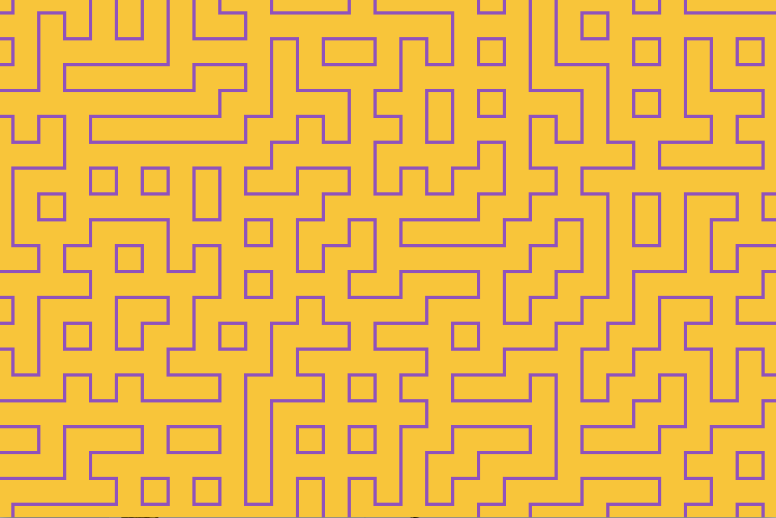
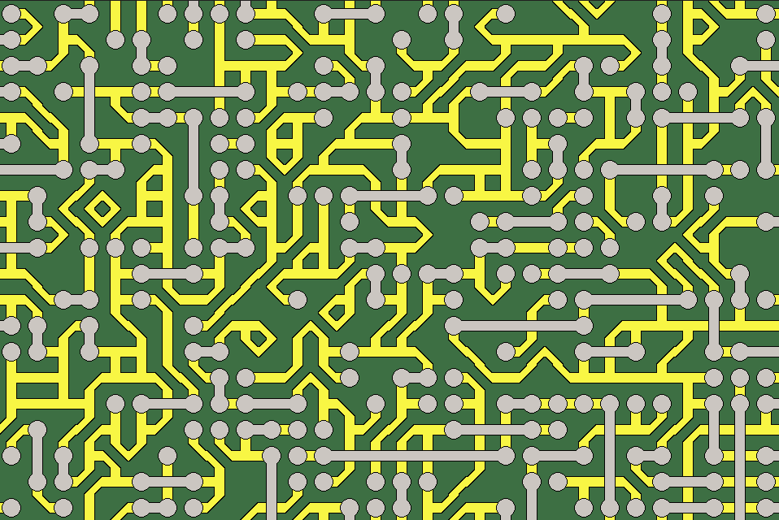

# Wave function collapse

This is a simple example of image generation using wave function collapse algorithm.

Inspired by [The Coding Train](https://www.youtube.com/watch?v=rI_y2GAlQFM&t=585s) video about wave function collapse.
## Examples:

#### 6 types of tiles

#### 31 types of tiles
